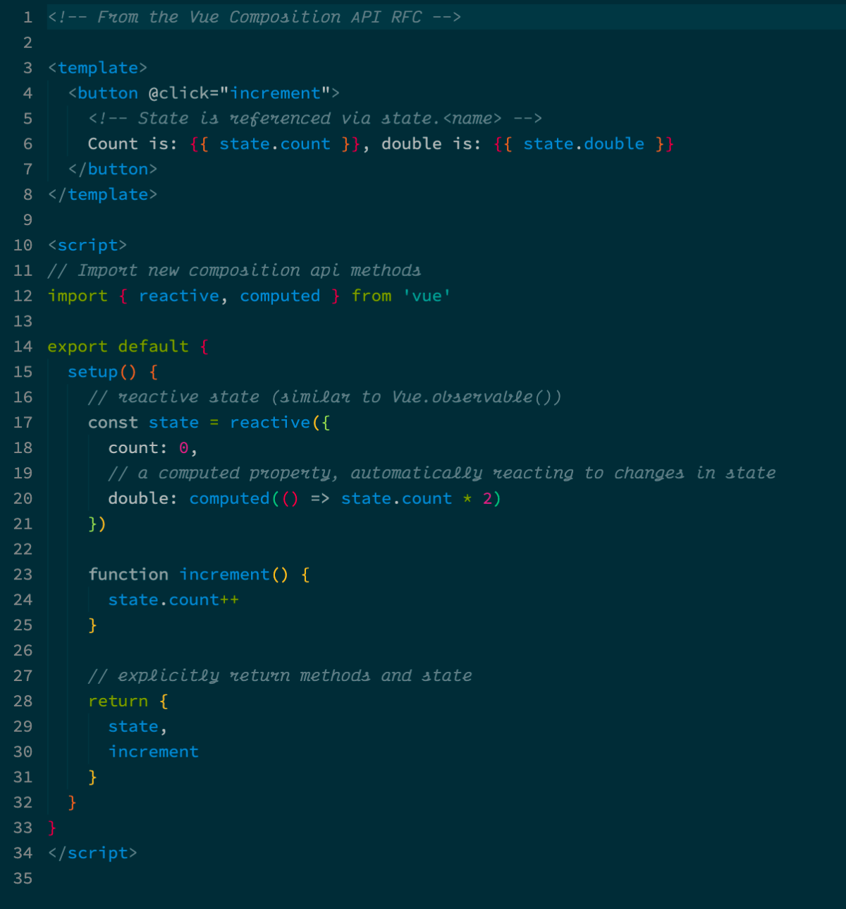
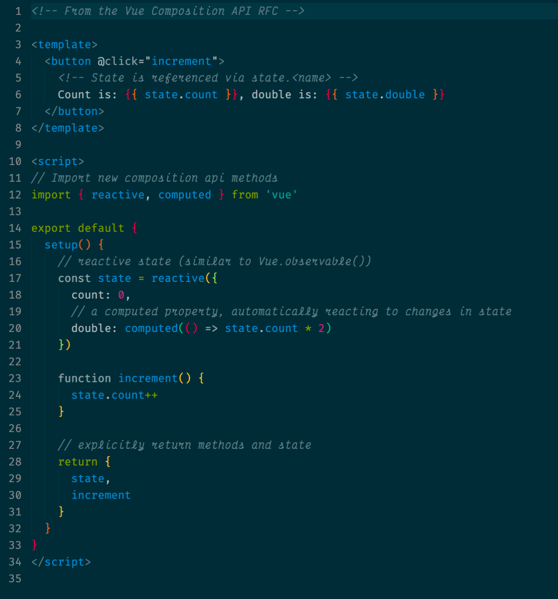

# 🧟 Victor Frankenstein: Free monospaced fonts with cursive italics

This repository contains altered versions of [Source Code Pro](https://github.com/adobe-fonts/source-code-pro) and [Fira Code](https://github.com/tonsky/FiraCode/) with cursive italics. This is achieved by combining the cursive letter glyphs from [Victor Mono](https://github.com/rubjo/victor-mono/) with the original fonts. The resulting fonts have been renamed to `Victor F Pro` and `Victor F Fira` respectively to prevent interferences with the original fonts.

The fonts have been merged / created in FontForge and have been adjusted to match glyph sizes. For `Victor F Pro` the cursive glyphs have also been slightly resized to match the sizing in `Source Code Pro`.

## ⚡️ Screenshots

### Victor F Pro

*Victor F Pro* (based on Source Code Pro).

### Victor F Fira

*Victor F Fira* (based on Fira Code).

## Download

The fonts can be downloaded under [releases](http://github.com/jansim/victor-frankenstein/releases).

